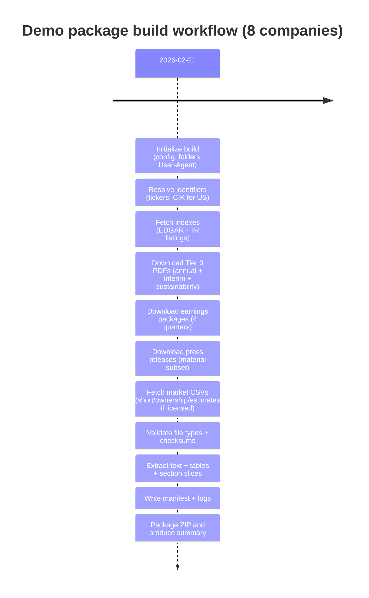

# Demo data package and ZIP plan for 8 fashion companies

[Download the report](sandbox:/mnt/data/fashion_demo_data_package_report.md)

**As-of date:** 2026-02-21 (America/New_York)  
**Assumed window for filing/report selection:** 2025-02-21 to 2026-02-21  
**Earnings materials window:** last 4 quarters (relative to 2026-02-21)  
**Company universe:** Nike (NKE), Lululemon (LULU), Under Armour (UAA), VF Corporation (VFC), Ralph Lauren (RL), Inditex (ITX.MC), H&M (HMB.ST), adidas (ADS.DE)

**Goal:** create a reproducible, audit-friendly demo ZIP that contains (a) primary-source PDFs/HTML/CSVs, (b) extracted text/tables suitable for scoring, and (c) a manifest that documents provenance and licensing constraints.

**Deliverables covered in this report**
- Prioritized “exact documents” to fetch per company (with deterministic selection rules)
- Primary source URL templates to prioritize per doc type
- Concrete scraping/download plan (tools, rate limiting, robots/ToS considerations, and fallbacks)
- ZIP folder structure + file naming conventions
- Metadata schema (manifest) + PDF extraction checklist (sections to parse)
- Minimal Python script outline for fetching, validating checksums, extracting text/tables, packaging ZIP
- Time and bandwidth estimates
- Risk & compliance notes (copyright, rate limits, PII)
- Sample manifest JSON + example file tree + mermaid workflow timeline

## Executive summary

A high-quality demo data package should behave like a mini research data lake: every file is traceable to a primary source, checksummed, and paired with extracted derivatives that your radar scoring system can consume (full text, section slices, extracted tables). For these 8 fashion companies, the documents with the highest signal density are annual and interim financial filings, the last four quarterly earnings “packages” (results press release + slides + transcript/prepared remarks/webcast link), and the latest sustainability/impact reports.

Prioritize official sources (regulators and company investor-relations portals). Treat third‑party earnings call transcripts and analyst estimate datasets as *licensed content by default*; if redistribution rights are unclear, do not include raw transcripts/estimate dumps in the ZIP—store derived features only (tone scores, topic counts, embeddings) and mark the source in metadata.

Typical scope for 8 large-cap fashion names is ~110–260 files and ~160 MB to 1.2 GB, depending on whether you snapshot press release HTML (and assets) and whether you extract tables into CSVs. With conservative throttling and mostly text-based PDFs (no OCR), the end-to-end build usually completes in ~30–90 minutes on a workstation.

## Document inventory and prioritized fetch list per company

### Prioritization tiers

**Tier 0 (must-have for a credible demo):**
- **Annual filing**: US = Form 10‑K; non‑US = annual report/annual financial report (prefer English editions).
- **Interim filings within the window**: US = all Form 10‑Q filed during the window; non‑US = interim/half‑year/quarterly reports in the window.
- **Earnings package for the last 4 quarters**: for each quarter, fetch the results press release, slides/presentation (if published), and prepared remarks/transcript if available. Also store the webcast link even if no transcript exists.
- **Latest sustainability / impact / ESG / “PDM” report** (or the sustainability section of the annual report if no standalone report is published).
- **Material press releases** in the last 12 months (results, leadership, restructuring, M&A, major legal/regulatory, guidance changes).

**Tier 1 (high value, often available):**
- US proxy statement (DEF 14A) for governance and beneficial ownership context.
- Non‑US shareholder structure tables and significant shareholder disclosures.
- Investor day and strategy presentations (if in last ~24 months).
- US 8‑K quarterly earnings exhibits (often contains the earnings release and sometimes slides).

**Tier 2 (nice-to-have; often licensed or compute-heavy):**
- Analyst estimates time series (consensus revenue/EPS and dispersion).
- Settlement-date short interest history (exchange files).
- Institutional ownership history (13F-based), plus 13D/13G beneficial owner changes.

### Deterministic selection rules for “exact” documents

To keep the package reproducible and avoid hand-picking, define the required documents with deterministic rules:

- **Annual filing:** pick the most recent annual filing whose filing/publication date is within the window; if none exists, pick the latest available and set `out_of_window=true` in metadata.
- **Interim filings:** pick every interim filing whose filing/publication date is within the window.
- **Earnings package (last 4 quarters):** pick the last 4 quarterly results events by event date; for each event, fetch the press release + slides + transcript/prepared remarks if available + webcast replay link.
- **Sustainability/PDM:** pick the most recent sustainability/impact report; if multiple exist, prefer the one closest to the annual report date.
- **Press releases:** fetch all in-window releases, then downselect to “material” using rule-based filters (results, leadership, restructuring, M&A, guidance, major legal/regulatory). Keep both (a) full press release index and (b) curated material subset.

### Required checklist per company

The table below expresses the fetch requirements per company in a single view.

| Company | Annual filing | Interim filings | Earnings materials (last 4 quarters) | Sustainability / PDM | Major press releases | Estimates/positioning (CSV) |
|---|---|---|---|---|---|---|
| Nike | latest 10‑K | all 10‑Q in window | press release + slides + transcript/prepared remarks + webcast link | latest impact/ESG | material IR releases | consensus (licensed), short interest, ownership |
| Lululemon | latest 10‑K | all 10‑Q in window | same | latest impact/ESG | same | same |
| Under Armour | latest 10‑K | all 10‑Q in window | same | latest sustainability | same | same |
| VF Corporation | latest 10‑K | all 10‑Q in window | same | latest sustainability/ESG | same | same |
| Ralph Lauren | latest 10‑K | all 10‑Q in window | same | latest CSR/ESG | same | same |
| Inditex | latest annual report | interim/half‑year/quarterly in window | results release + slides + transcript/prepared remarks (if available) | latest sustainability | material releases | consensus (licensed), local short/ownership |
| H&M | latest annual report | interim/quarterly in window | same | latest sustainability | material releases | consensus (licensed), local short/ownership |
| adidas | latest annual report | interim/half‑year in window | same | latest sustainability | material releases | consensus (licensed), local short/ownership |

## Primary sources and URL map to prioritize

This demo package should overwhelmingly use **primary sources** (regulators, exchanges, and company investor-relations portals). The exact *documents* (specific PDF/HTML URLs) should be discovered at build time using the deterministic rules above; the URLs below are the canonical starting points.

### US filings (10‑K/10‑Q/8‑K/DEF 14A/13D/13G/13F)

Primary: SEC EDGAR.

Use these stable endpoints (exact templates):

```text
EDGAR company browse page:
  https://www.sec.gov/edgar/browse/?CIK={ticker_or_cik}

EDGAR search UI:
  https://www.sec.gov/edgar/search/

Browse-company query (supports filing type filter; output=atom returns an RSS/Atom-style feed):
  https://www.sec.gov/cgi-bin/browse-edgar?action=getcompany&CIK={ticker_or_cik}&type={10-K|10-Q|8-K|DEF+14A}&count=100&owner=exclude&output=atom

Direct file download (once CIK + accession are known):
  https://www.sec.gov/Archives/edgar/data/{cik}/{accession_nodashes}/{primary_doc}
```

Operationally, your build tool should:
- Resolve a company’s CIK (via EDGAR company browse/search).
- Enumerate filings in window (10‑K, 10‑Q, 8‑K earnings releases, DEF 14A).
- Download the primary filing document (often HTML) and optionally generate a PDF version for uniformity.
- Optionally download earnings 8‑K exhibits (e.g., Exhibit 99.1 earnings press release).

### Non‑US annual/interim filings

Primary: company IR “Reports / Results / Financial information” pages (prefer English PDFs).

Secondary (fallback when IR is incomplete or blocked):
- Spain: CNMV + BME issuer portals.
- Sweden: Nasdaq Stockholm issuer portal (and issuer IR reports).
- Germany: Bundesanzeiger and exchange issuer portals (and issuer IR reports).

### Earnings packages and transcripts

Preferred order of sources:
1) Company IR “Events & Presentations / Quarterly results” pages (official press release, slides, webcast, and sometimes a transcript/prepared remarks).
2) US 8‑K earnings exhibits (press release; sometimes slides).
3) Licensed transcript providers (only if licensed; otherwise compute derived features and omit raw transcripts from the ZIP).

**Important:** full Q&A transcripts are frequently *not* published on official IR sites. Design your pipeline so the transcript is optional and your “Narrative & Tone” features can still be extracted from press releases, prepared remarks, and risk-factor language trends in filings.

### Analyst estimates, short interest, and ownership

These are the most common “gotcha” sources for demo packaging:

- **Analyst estimates (consensus and dispersion):** typically licensed datasets (store as CSV only if licensed, otherwise store derived summary features).
- **Short interest:** prefer settlement-date short interest data from the listing exchange if available. If not available, store a proxy series (e.g., daily short sale volume) labeled as a proxy.
- **Institutional ownership:** US SEC filings (13F/13D/13G plus DEF 14A); non‑US shareholder structure tables and significant ownership disclosures.

### Company seed URL table

Use these as seed URLs for discovery (treat paths as “entry points,” not guaranteed stable document endpoints).

| Company | company_id | Ticker | Listing | IR seed | Press seed | Sustainability seed | Filings seed |
|---|---|---|---|---|---|---|---|
| Nike | nike | NKE | NYSE (US) | `https://investors.nike.com/` | `https://investors.nike.com/news-events/press-releases/` | `https://purpose.nike.com/` | `https://www.sec.gov/edgar/browse/?CIK=NKE` |
| Lululemon | lululemon | LULU | NASDAQ (US) | `https://investor.lululemon.com/` | `https://investor.lululemon.com/news-releases/` | `https://corporate.lululemon.com/our-impact` | `https://www.sec.gov/edgar/browse/?CIK=LULU` |
| Under Armour | under_armour | UAA | NYSE (US) | `https://about.underarmour.com/investors` | `https://about.underarmour.com/news` | `https://about.underarmour.com/sustainability` | `https://www.sec.gov/edgar/browse/?CIK=UAA` |
| VF Corporation | vf_corp | VFC | NYSE (US) | `https://investors.vfc.com/` | `https://investors.vfc.com/news-and-events/press-releases/` | `https://www.vfc.com/sustainability` | `https://www.sec.gov/edgar/browse/?CIK=VFC` |
| Ralph Lauren | ralph_lauren | RL | NYSE (US) | `https://investor.ralphlauren.com/` | `https://investor.ralphlauren.com/press-releases` | `https://corporate.ralphlauren.com/` | `https://www.sec.gov/edgar/browse/?CIK=RL` |
| Inditex | inditex | ITX.MC | BME Madrid (ES) | `https://www.inditex.com/investors` | `https://www.inditex.com/` | `https://www.inditex.com/sustainability` | `Primary via IR; secondary via CNMV/BME portals` |
| H&M | hm | HMB.ST | Nasdaq Stockholm (SE) | `https://hmgroup.com/investors/` | `https://hmgroup.com/news/` | `https://hmgroup.com/sustainability/` | `Primary via IR; secondary via exchange portal` |
| adidas | adidas | ADS.DE | Xetra/Frankfurt (DE) | `https://www.adidas-group.com/en/investors/` | `https://www.adidas-group.com/en/media/news-archive/` | `https://www.adidas-group.com/en/sustainability/` | `Primary via IR; secondary via Bundesanzeiger/exchange portal` |

## Concrete scraping and download plan

### Tooling

A minimal but robust toolchain:

- HTTP fetching: `httpx` (timeouts, redirects) + `tenacity` (retries/backoff)
- HTML parsing and link discovery: `beautifulsoup4`
- HTML-to-text extraction (optional but helpful for press releases/news): `trafilatura`
- PDF text extraction: `pymupdf` (fast), fallback `pdfplumber` (layout-specific needs)
- PDF table extraction: `camelot` (vector tables); optional `tabula-py` (requires Java) for hard cases
- Integrity + packaging: SHA‑256 via `hashlib`, ZIP via `zipfile`, MIME detection via `filetype` or `python-magic`

### Rate limiting and politeness defaults

Implement per-host throttling and global concurrency. Suggested conservative defaults:

- EDGAR: 1–5 requests/sec, concurrency 1–2, cache aggressively, backoff on 429/503.
- IR domains: 0.5–2 requests/sec per domain, concurrency 2–4.
- Global cap: 6–8 concurrent downloads total across all hosts.
- Always set a descriptive `User-Agent` header including a contact email.

Additionally:
- Use `If-Modified-Since` / `ETag` caching where supported.
- Store the “index pages” you parse (or at least cache parsed results) so reruns don’t redownload everything.

### Robots/ToS compliance and legal considerations

- Fetch and honor `robots.txt` for HTML crawling; do not crawl disallowed paths.
- Do not bypass paywalls, login walls, or anti-bot systems.
- Maintain a domain allowlist (SEC + your target company IR domains) and denylist questionable sources by default.
- Mark each file in the manifest with `source_type` (`primary`, `secondary`, `licensed`) and `redistributable` (`true/false`).

### Fallback sources strategy

When a primary seed URL fails or content is missing:

1) **US annual/interim:** EDGAR is canonical; use it as the fallback truth source.
2) **Non‑US annual/interim:** try (a) IR reports pages, then (b) regulator/exchange portals, then (c) annual report mirrors (only if allowed).
3) **Transcripts:** if no official transcript exists, store webcast + press release + slides; compute tone features from available text.
4) **Tables:** if table extraction fails, store “table extraction failed” flags and keep text extraction; optionally store the page image for manual inspection.

### Validation and QA checks

At download time, validate:
- status code and content type
- MIME type matches expected (PDF/HTML/CSV)
- file headers (PDF magic bytes `%PDF-`)
- byte size sanity (avoid saving tiny HTML error pages as PDFs)

Post-download, compute:
- SHA‑256 checksums for every file
- extraction success metrics (text length, number of tables extracted, number of section slices found)

## File naming and folder structure for the ZIP

### Recommended folder structure

```text
fashion_demo_package_2026-02-21/
  manifest.json
  checksums.sha256
  README.md
  companies/
    {company_id}/
      source/
        sec_edgar/           # US
          10k/
          10q/
          8k/
          def14a/
          13d_13g/
        ir/
          earnings/
          presentations/
          press_releases/
          sustainability/
        regulator_or_exchange/  # non-US fallback
      extracted/
        text/
        sections/
        tables/
  datasets/
    market_data/
      short_interest/
      ownership/
      analyst_estimates/
  logs/
    download_log.jsonl
    extraction_log.jsonl
```

### File naming convention

Use a deterministic, sortable pattern that encodes company, doc type, date, and source:

```text
{company_id}__{doc_type}__{fiscal_period_end_or_doc_date}__{source}__{lang}__{slug}.{ext}
```

Examples:
- `nike__10k__2025-05-31__sec_edgar__en__form-10k.html`
- `nike__10k__2025-05-31__sec_edgar__en__form-10k.pdf`
- `adidas__annual_report__2024-12-31__ir__en__annual-report.pdf`
- `hm__interim_report__2025-08-31__ir__en__q3-report.pdf`
- `vf_corp__press_release__2025-10-30__ir__en__q2-results.html`

### ZIP contents policy

Include in the ZIP:
- raw source files (PDF/HTML/CSV)
- extracted derivatives (text, section slices, extracted tables)
- integrity data (manifest + SHA‑256 list)
- a README describing selection windows, known missing items, and licensing restrictions

Exclude (or mark as non-redistributable):
- any paywalled or third‑party transcript/estimate dataset unless you explicitly have redistribution rights

## Metadata schema for each file and PDF extraction checklist

### Manifest record schema (per file)

Each file in the ZIP should have one manifest record (JSON object). Recommended fields:

| Field | Type | Example | Notes |
|---|---|---|---|
| `file_id` | string | `nike__10k__2025-05-31__sec_edgar__en__form-10k.pdf` | should match filename |
| `company_id` | string | `nike` | stable identifier |
| `company_name` | string | `Nike` | display |
| `ticker` | string | `NKE` | optional |
| `doc_type` | string | `10k`, `10q`, `annual_report`, `press_release`, `earnings_slides` | controlled vocabulary |
| `fiscal_period_end` | date | `2025-05-31` | if applicable |
| `filing_date` | date | `2025-07-15` | if applicable |
| `doc_date` | date | `2025-09-30` | for press/releases/events |
| `source_type` | string | `primary`, `secondary`, `licensed` | compliance |
| `source_url` | string | `https://...` | provenance |
| `fetched_at_utc` | datetime | `2026-02-21T19:04:11Z` | reproducibility |
| `byte_size` | int | `14839210` | sanity checks |
| `mime_type` | string | `application/pdf` | validation |
| `sha256` | string | `...` | integrity |
| `redistributable` | bool | `true/false` | copyright |
| `confidence` | float | `0.95` | quality |
| `extracted_text_path` | string | `companies/nike/extracted/text/...txt` | optional |
| `table_csv_paths` | list[string] | `[...]` | optional |
| `extraction_notes` | string | `camelot_stream_ok; 1_table_failed` | optional |

Recommended package-level metadata (top of `manifest.json`):
- `as_of`, `since`, `peer_set`, `build_version`
- `build_host`, `python_version`, `git_commit` (if you want reproducible builds)
- `license_notes` (freeform)

### PDF extraction checklist

For each annual/interim report PDF, extract these sections when present and store both the raw section text and section boundaries (start/end offsets):

- Risk Factors / Principal Risks
- MD&A / Management’s Discussion & Analysis / Operating Review
- Competition and competitive landscape commentary
- Contracts and customers (contract length, customer concentration, DTC vs wholesale mix, licensing)
- Legal proceedings / contingencies
- Notes to the financial statements
- Segment reporting tables (geo, brand, channel, business segment)
- Share-based compensation notes (SBC)
- Cash flow and capital allocation (capex, buybacks, dividends, debt/liquidity)
- FX exposure, commodity sensitivity, and hedging discussion

Table extraction targets (CSV):
- segment revenue by geography/brand/channel
- gross margin / operating margin bridge tables (if present)
- inventory, receivables, payables, and cash flow line items
- lease commitments and debt maturity tables

## Minimal Python script outline, estimates, and compliance notes

### Minimal script outline (pseudocode)

```python
# scripts/build_demo_package.py (outline)

import hashlib, json, zipfile
from pathlib import Path
import httpx
from tenacity import retry, wait_exponential_jitter, stop_after_attempt

def sha256_file(path: Path) -> str:
    h = hashlib.sha256()
    with path.open("rb") as f:
        for chunk in iter(lambda: f.read(1024 * 1024), b""):
            h.update(chunk)
    return h.hexdigest()

@retry(wait=wait_exponential_jitter(1, 30), stop=stop_after_attempt(6))
def download(url: str, dest: Path, headers: dict) -> dict:
    with httpx.Client(timeout=60.0, follow_redirects=True, headers=headers) as c:
        r = c.get(url)
        r.raise_for_status()
        dest.write_bytes(r.content)
    return {"sha256": sha256_file(dest), "byte_size": dest.stat().st_size}

def validate_pdf(path: Path) -> bool:
    return path.read_bytes()[:5] == b"%PDF-"

def extract_pdf(pdf_path: Path, out_text: Path, out_tables_dir: Path) -> dict:
    # 1) text extraction with pymupdf/pdfplumber
    # 2) section splitting (rule-based headings + TOC heuristics)
    # 3) table extraction with camelot (lattice + stream)
    return {"text_path": str(out_text), "tables": [], "notes": ""}

def build():
    # 0) load config: companies, seed urls, since/as_of
    # 1) discover exact documents (EDGAR indexes + IR link discovery)
    # 2) download (throttled per-domain; robots checks)
    # 3) validate file types + compute sha256
    # 4) extract text/tables/sections from PDFs
    # 5) write manifest.json and checksums.sha256
    # 6) zip folder into fashion_demo_package_YYYY-MM-DD.zip
    pass
```

### Estimated time and bandwidth

Planning ranges (Tier 0 + selected Tier 1):

| Scope | Expected files | Download size | Wall-clock build time |
|---|---:|---:|---:|
| Per US company | ~15–35 | ~20–150 MB | ~5–20 min |
| Per non‑US company | ~12–30 | ~15–120 MB | ~5–20 min |
| Total (8 companies) | ~110–260 | ~160 MB–1.2 GB | ~30–90 min |

Primary drivers of time/size:
- whether you snapshot press releases as HTML (+ assets) or store only extracted text
- whether you extract tables to CSV (recommended for scoring)
- whether any PDFs are scanned (OCR is slow; avoid for demo unless needed)

### Risk and compliance notes

- **Copyright:** assume third‑party transcripts and analyst estimate datasets are not redistributable unless you have explicit rights; exclude or mark `redistributable=false`.
- **Rate limits:** throttle and backoff to avoid burdening source infrastructure; cache aggressively.
- **PII:** press pages can include contact emails/phone numbers; optionally redact in extracted text.
- **Integrity:** validate MIME and PDF headers; keep checksums to prevent silent corruption (e.g., HTML error page saved as “.pdf”).
- **Explainability:** selection rules + provenance should be explicit in the manifest so the demo is defensible in an institutional setting.

### Sample manifest JSON and example file tree

```json
{
  "package": {
    "as_of": "2026-02-21",
    "since": "2025-02-21",
    "peer_set": "fashion_global_8",
    "build_version": "0.1.0"
  },
  "files": [
    {
      "file_id": "nike__10k__2025-05-31__sec_edgar__en__form-10k.pdf",
      "company_id": "nike",
      "company_name": "Nike",
      "ticker": "NKE",
      "doc_type": "10k",
      "fiscal_period_end": "2025-05-31",
      "filing_date": "2025-07-15",
      "source_type": "primary",
      "source_url": "https://www.sec.gov/Archives/edgar/data/...",
      "fetched_at_utc": "2026-02-21T19:04:11Z",
      "byte_size": 14839210,
      "mime_type": "application/pdf",
      "sha256": "b5b7b1...",
      "redistributable": true,
      "confidence": 0.98,
      "extracted_text_path": "companies/nike/extracted/text/nike__10k__2025-05-31__sec_edgar__en__form-10k.txt",
      "table_csv_paths": [
        "companies/nike/extracted/tables/nike__10k__2025-05-31__sec_edgar__en__form-10k__p87__t1.csv"
      ],
      "extraction_notes": "pymupdf_text_ok; camelot_stream_tables_ok"
    }
  ]
}
```

```text
fashion_demo_package_2026-02-21/
  manifest.json
  checksums.sha256
  companies/
    nike/
      source/sec_edgar/10k/nike__10k__2025-05-31__sec_edgar__en__form-10k.pdf
      extracted/text/nike__10k__2025-05-31__sec_edgar__en__form-10k.txt
```

### Mermaid timeline for the scraping workflow



## Translation approach for non-English materials

Prioritize English-language annual reports, interim reports, and press releases wherever each company provides an English edition. When an official report or regulator-hosted document is only available in a local language (e.g., Spanish, Swedish, German):

- Store the original extracted text as `{file_id}__{lang}.txt` (e.g., `__es.txt`, `__sv.txt`, `__de.txt`) and keep `lang` in the manifest.
- Optionally produce a machine-translated parallel text file (e.g., `__en_translated.txt`) for downstream NLP scoring, and record translation method + timestamp in `extraction_notes`.
- Lower `confidence` for translated derivatives if the translated text is used for scoring, and keep the source-language artifacts as the audit trail.